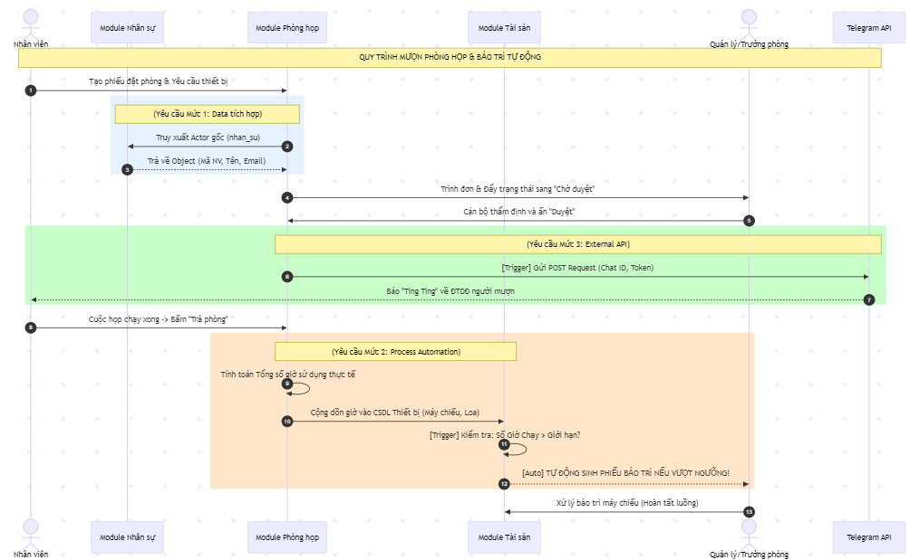

<h2 align="center">
    OFFICE RESOURCE MANAGER
</h2>
<div align="center">

[](https://www.odoo.com/)
[](https://www.python.org/)

</div>

## 📖 1. Giới thiệu
**Office Resource Manager** là hệ thống quản lý tài nguyên doanh nghiệp được xây dựng trên nền tảng Odoo. Hệ thống tập trung vào việc số hóa quy trình quản lý hành chính nội bộ. Học Phần: Hội nhập và quản trị phần mềm doanh nghiệp - Đề Tài 6.

### Các module chính:
1.  **Quản lý Nhân sự (`nhan_su`)**: Hồ sơ nhân viên, quản lý thông tin cá nhân.
2.  **Quản lý Tài sản (`quan_ly_tai_san`)**: Theo dõi tài sản, khấu hao, bảo trì, cấp phát tài sản cho nhân viên.
3.  **Quản lý Phòng họp (`quan_li_phong_hop_hoi_truong`)**: Đặt phòng họp, duyệt yêu cầu, tránh trùng lịch.

## 🔀 2. Luồng nghiệp vụ tổng quan (Business Flow)


- **Mô tả quy trình**: Quy trình bao quát luồng mượn phòng họp và sử dụng tài sản kèm theo.
- **Các module tham gia**: Quá trình mượn lấy gốc tọa độ từ **Module Nhân sự**. Tự động hóa Mức 2 được kích hoạt khi phòng được trả, tự động sinh **Phiếu bảo trì** (bên Module Tài sản) nếu thiết bị chạy quá công suất. Tự động hóa Mức 3 cho phép gọi **External API Telegram** để push thông báo tự động ngay khi Quản lý duyệt phòng.

## 🚀 3. Hướng dẫn Cài đặt & Sử dụng

### 3.1. Clone dự án
Tải mã nguồn về máy:
```bash
git clone https://github.com/HOANGTHI2509/office-resource-manager.git
cd office-resource-manager
```

### 3.2. Cài đặt môi trường
Yêu cầu: `Python 3.10`, `PostgreSQL`, `Docker` (tùy chọn).

1.  **Cài đặt thư viện hệ thống (Ubuntu/WSL):**
    ```bash
    sudo apt-get install libxml2-dev libxslt-dev libldap2-dev libsasl2-dev libssl-dev python3.10-dev build-essential libpq-dev
    ```

2.  **Tạo môi trường ảo & cài dependencies:**
    ```bash
    python3.10 -m venv venv
    source venv/bin/activate
    pip install -r requirements.txt
    ```

### 3.3. Cấu hình Database
Sử dụng Docker để chạy PostgreSQL nhanh chóng:
```bash
sudo docker-compose up -d
```

### 3.4. Cấu hình Odoo
Tạo file `odoo.conf` (hoặc copy từ template):
```ini
[options]
addons_path = addons
db_host = localhost
db_password = odoo
db_user = odoo
db_port = 5431
xmlrpc_port = 8069
```

### 3.5. Chạy hệ thống
```bash
python3 odoo-bin.py -c odoo.conf -u nhan_su,quan_ly_tai_san,quan_li_phong_hop_hoi_truong
```
Truy cập: `http://localhost:8069`
Tài khoản mặc định (nếu dùng demo data): `admin` / `admin`

## 🤝 Đóng góp
Dự án được phát triển dựa trên nền tảng Business Internship của Khoa CNTT - Đại học Đại Nam.
